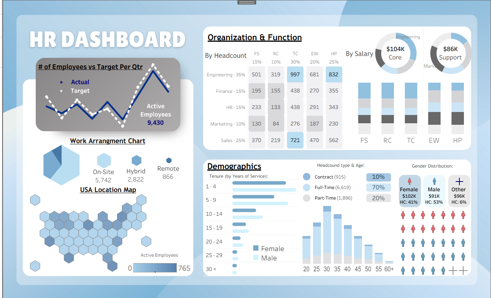

# HR Analytics Dashboard

An interactive **Tableau HR Analytics Dashboard** built to analyze workforce composition, employee demographics, compensation, work arrangements, geographic distribution, and organizational performance.

## Project Overview

This dashboard analyzes a sample HR dataset containing **9,430 employee records**. It provides a high-level view of workforce trends while allowing HR metrics to be compared across organizational groups, functions, employee types, and locations.

The dashboard focuses on four main areas:

* Employee headcount and quarterly targets
* Organization and function performance
* Work arrangements and geographic distribution
* Employee demographics, tenure, age, and compensation

## Dashboard Insights

### Workforce Overview

* **9,430 active employees**
* Quarterly actual vs. target headcount from **2023 Q1 to 2025 Q1**
* Tracks changes in workforce size against organizational targets

### Organization & Function

Employees are analyzed across five business functions:

* Engineering — **35%**
* Sales — **25%**
* Finance — **15%**
* HR — **15%**
* Marketing — **10%**

The dashboard compares both **employee headcount and salary** across the FS, RC, TC, EW, and HP organizational groups.

Average salary by organizational category:

* **Core:** ~$104K
* **Support:** ~$86K

### Work Arrangement

The workforce is divided into:

* **On-Site:** 5,742 employees
* **Hybrid:** 2,822 employees
* **Remote:** 866 employees

A U.S. hex map is also used to visualize employee distribution across different states.

### Employee Demographics

**Employment Type**

* Full-Time: **6,619**
* Part-Time: **1,896**
* Contract: **915**

**Gender Distribution**

* Female: **41%** — ~$102K average salary
* Male: **53%** — ~$91K average salary
* Other: **6%** — ~$96K average salary

The dashboard also explores:

* Employee age distribution
* Years of service / tenure
* Gender representation
* Workforce composition by employment type

## Tableau Features Used

* Interactive dashboard design
* Calculated fields
* FIXED Level of Detail (LOD) expressions
* Binned age and tenure groups
* Conditional formatting
* Custom legends
* Dual-axis and donut visualizations
* Waffle chart
* U.S. hex map
* KPI and target tracking
* Dashboard containers and custom formatting

### `HR-Dashboard.twbx`

Packaged Tableau workbook containing the dashboard, worksheets, and embedded Tableau data extracts.

### `HR-Data.xlsx`

Source dataset containing three worksheets:

* **Employee Data** — 9,430 employee records across 13 HR attributes
* **Totals** — quarterly actual vs. target employee headcount
* **Waffle Chart** — helper data used to build the gender visualization

Employee attributes include job function, role, age, years of service, organization, location, work arrangement, employee type, gender, and salary.

## Tools Used

* **Tableau Desktop** — Data visualization and dashboard development
* **Microsoft Excel** — Data source and supporting datasets

## How to View

Download `HR-Dashboard.twbx` and open it using **Tableau Desktop** or **Tableau Reader**.

## Note

This project uses **sample HR data** and was created for data analytics, visualization, and portfolio purposes.
